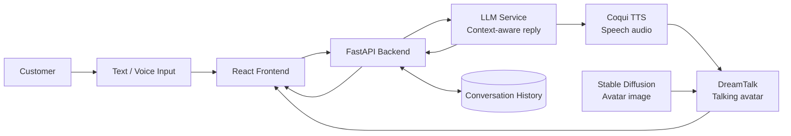

<div align="center">

# GenAssist

### Generative AI Customer Support Avatar

*Human-like, multimodal customer support powered by conversational AI, voice synthesis, and talking avatars.*


</div>


## What is GenAssist?

GenAssist is an AI-powered customer-support assistant that transforms a text or voice query into a complete multimedia answer: a context-aware response, natural speech, and a lip-synchronised talking avatar. It is designed to make self-service support feel more conversational, accessible, and engaging than a conventional text-only chatbot.

## Key capabilities

- **Text and voice input** - lets customers ask for help in the way that suits them.
- **Context-aware replies** - an LLM interprets requests and maintains conversation context.
- **Natural speech** - converts each generated answer into audio with Coqui TTS.
- **Talking-avatar delivery** - DreamTalk synchronises speech with an avatar video.
- **Custom avatar imagery** - Stable Diffusion can generate or customise avatar portraits.
- **Conversation history** - stores interactions to enable continuous, contextual support.

## How it works



<details>
<summary><strong>Request lifecycle</strong></summary>

1. A customer submits a text or voice request in the web UI.
2. The FastAPI backend validates the request and sends it to the LLM.
3. The LLM returns a concise, context-aware answer.
4. Coqui TTS synthesises the answer into speech.
5. DreamTalk combines the audio with an avatar image to produce a talking-avatar video.
6. The UI presents the text, audio, and avatar response; the interaction can be stored for future context.

</details>

## Tech stack

| Layer | Technologies |
| --- | --- |
| Frontend | React, JavaScript, HTML5, CSS3, Tailwind CSS |
| API | Python, FastAPI, Uvicorn, Pydantic |
| Conversational AI | OpenAI-compatible LLM integration |
| Speech | Coqui Text-to-Speech |
| Avatar | DreamTalk, Stable Diffusion |
| Storage | SQLite or MongoDB |

## Demo

| System pipeline | Live support interface |
| --- | --- |
|  |  |

## Getting started

### Prerequisites

- Python 3.10+
- Node.js 18+
- An API key for the configured LLM provider
- Optional GPU support for faster avatar/image inference

### Installation

```bash
git clone https://github.com/<your-username>/genassist.git
cd genassist

# Backend
pip install -r requirements.txt

# Frontend
cd frontend
npm install
```

### Configuration

Create a `.env` file in the backend directory and provide the credentials your LLM client requires:

```env
OPENAI_API_KEY=your_api_key_here
```

> Never commit `.env` files or real API keys. Add `.env` to `.gitignore`.

### Run locally

In one terminal, start the backend:

```bash
uvicorn main:app --reload
```

In another terminal, start the React app:

```bash
cd frontend
npm run dev
```

Open the local URL shown by the frontend development server and start a conversation.

## API overview

### `POST /api/chat`

Sends a customer message through the generation pipeline.

```json
{ "message": "How can I reset my password?" }
```

Example response shape:

```json
{
  "query": "How can I reset my password?",
  "response": "...",
  "audio": "generated_audio/response.wav",
  "avatar": "generated.mp4",
  "status": "success"
}
```

### `GET /api/status`

Returns the service availability status.

## Project structure

```text
genassist/
├── main.py                 # FastAPI app entry point
├── routes/
│   └── chat.py             # Chat endpoints
├── services/
│   ├── llm.py              # Response generation
│   ├── tts.py              # Speech synthesis
│   ├── avatar_image.py     # Avatar image generation
│   ├── avatar_video.py     # Talking-avatar generation
│   └── workflow.py         # End-to-end pipeline
├── frontend/               # React user interface
└── database.py             # Conversation storage
```

<details>
<summary><strong>Future directions</strong></summary>

- Multilingual and voice-to-voice support
- Sentiment-aware, more empathetic replies
- More expressive 3D avatars
- CRM and e-commerce integrations
- Cloud deployment for higher availability and concurrent usage
- Mobile and cross-platform clients

</details>

## Use cases

GenAssist is adaptable to e-commerce, education, healthcare, banking, and online-service support scenarios where customers benefit from fast, accessible, and engaging assistance.

## Acknowledgements

This project builds on FastAPI, React, OpenAI-compatible language models, Coqui TTS, DreamTalk, and Stable Diffusion.

---

<div align="center">
  Built as an academic project at Keshav Memorial Engineering College.
</div>
